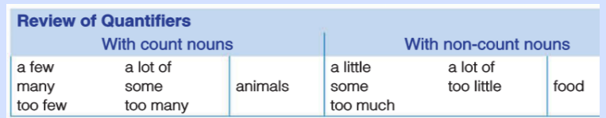

# Unit 7
## Passive voice (present tense)
Kristel is loved

- Subject  + is/am/are + verb in past participle 

Is Kristel loved/

- Is/Am/Are + subject + verb in past participle 

## Passive voice (using by)
Kristel is loved by Jesus

- Subject  + is/am/are + verb in past participle + by 

# Unit 8
## Real conditionals in the future
If we study today, we will be successful tomorrow

- If + simple present + future simple

Will we be successful tomorrow if we study today? **Yes, we will**
What is going to happen if we study? ****

- Wh question + **will / be goin to** + the base form of the verb + if + subject + present verb 
## Review of quantifiers with count nouns and non-count nouns

# Unit 9
## Used to

Kristel used to stay at home as a kid
- Subject + used to + verb in present  

I didn't use to like coffee.
- Sujeto + didn't use to + verbo en base

Did you use to play football?"
- Did + sujeto + use to + verb in present?

## Passive voice in the past
Happy was fed yesterday
- Subject + was/were + past participle + complement (optional)

The dogs were not fed last night
- Subject + was/were + not + past participle+ complement (optional)

Were the dogs fed last night?
- Was/Were + subject + past participle + complement (optional)

